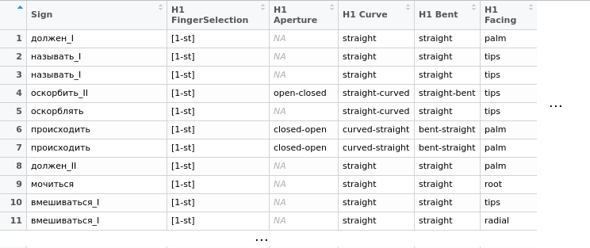
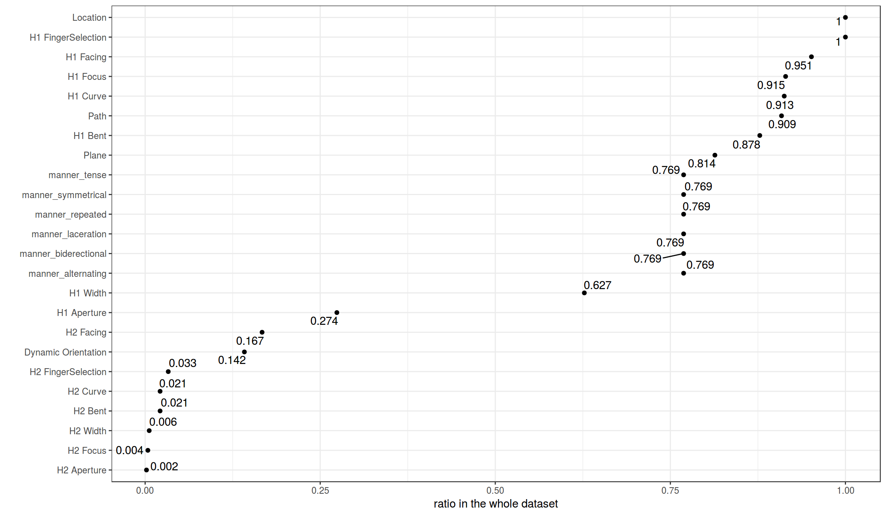
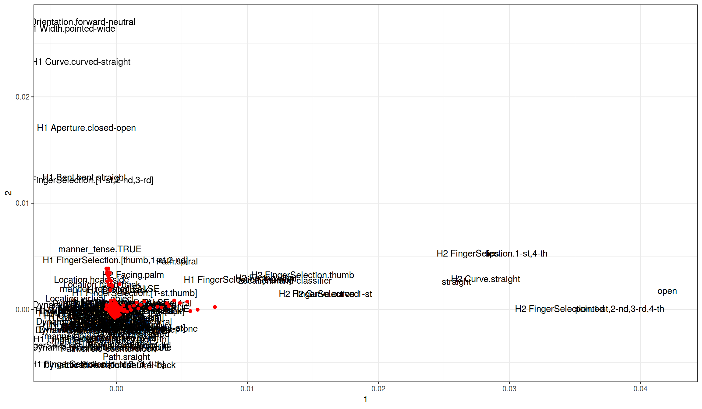
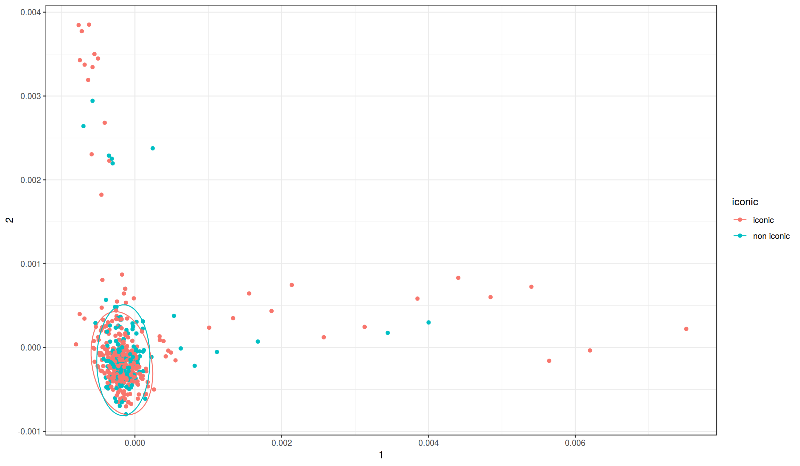

# Data and method {#sec:data} 

We take @Plaskovitskaya:2018, which is, as far as we are aware, the only existing description of RSL phonological system to date, as the point of departure for our study both empirically and analytically. The data for our study comes from a small annotated corpus presented in @Plaskovitskaya:2018, whose main aim was to test the predictions of existing approaches to SL phonology against the data from RSL, and to compile a preliminary inventory of phonological primitives in RSL as well as sketch a model of their compositional interaction.

## The model: @Plaskovitskaya:2018

The model in @Plaskovitskaya:2018 is a modified version of Van der Kooij's [-@vanderKooij:2002] *Dependency model*. Like @vanderKooij:2002, and unlike most of the other models of sign language phonology, it is inductively organised and crafted on the basis of large datasets, rather than being deductive in character. It is also hierarchical: head nodes can restrict the values of their dependent nodes, which, in turn, modify them. The Dependency model and its descendants differ from most of the other phonological models in viewing movement as a phonetic/prosodic reflex rather than as a separate parameter as described in [@Sec:properties] above. In such a model, signs are conceptualised as consisting of at least two states (e.g. an initial state and a final state), movement being a mere transition from the initial state to the final state. The proposed hierarchical structure of an RSL sign is schematically represented in @Fig:plaskovitskaya. 

![RSL phonology [@Plaskovitskaya:2018]](RSL-phonology-plaskovitskaya-2018-model.pdf){#fig:plaskovitskaya}

As can be glimpsed from the representation in @Fig:plaskovitskaya, @Plaskovitskaya:2018 indeed follows @vanderKooij:2002 in removing movement in the case of the active articulator from within the purview of phonology and assigns it a phonetic/prosodic status, whereas the passive articulator is specified with both Location and Trajectory nodes with an internal complexity of their own.

By way of illustration, let us consider a minimal working example of the model at work: the RSL  sign for \textsc{betray}, for instance, will receive the schematic representation in @Fig:betray.

{#fig:betray}

The sign involves two articulators: an active articulator (i.e. the dominant hand) and a passive articulator corresponding to the middle of the signer's face (Location: mid-head). Four fingers of the dominant hand are extended (Curve: straight), and the dominant hand dynamically changes orientation from prone (i.e. palm facing down) to neutral.

Perhaps the most significant departure of @Plaskovitskaya:2018 from @vanderKooij:2002 concerns the placement of the [symmetrical] and [crossed] features in the hierarchical representation of RSL signs:[^4] whilst @vanderKooij:2002 situates them inside the Manner node (which is structurally higher than any of the articulators), @Plaskovitskaya:2018 notes that they are restricted to the Active Articulator node, and their original positioning in the Manner node runs the risk of generating unattested interpretations. To see the necessity of this modification, let us consider the symmetrical 2-hand sign \textsc{deter}, which is schematically represented in @Fig:deter.

The RSL sign for \textsc{deter} involves two active articulators (H1 and H2) with \textsf{fist} as the requisite handshape synchronically moving along a straight diagonal path from a higher to a lower position in front of the passive articulator (trunk). Since both H1 and H2 are moving symmetrically, the [symmetrical] feature must be present in the representation, which @vanderKooij:2002 situates in the Manner node dominating both the active and passive articulators. This makes the prediction that the sign's symmetricity must also apply to the passive articulator, contrary to fact. @Plaskovitskaya:2018, on the contrary, introduces an additional node that she dubs Multiple articulators above the active articulator but crucially below the passive one, thereby capturing the narrow scope of [symmetrical] in all cases.

{#fig:deter}

With the basic familiarity with both the model in hand, we are now in a position to explore the frequency of occurrence (and cooccurrence) of the phonetic and phonological features within the RSL lexicon as compiled by @Plaskovitskaya:2018. The motivation behind this is as follows: since the model ascribes some features (but not others) a phonological status, this should be visible in the data because subsets of those features---as well as segments of which they consist---will form natural classes like vowels do as opposed to consonants in spoken languages. But first, we offer a few words on the data.

## Data

Plaskovitskaya's [-@Plaskovitskaya:2018] corpus consists of  400 primarily monomorphemic, citation-form verbs taken from the [*Spread the Sign* dictionary](http://www.spreadthesign.com/be/) in the Belarusian dialect of Russian Sign Language. Because the signs normally appear in the dictionary in their citation form, annotation also resorted to entries from other dialects of RSL from the same dictionary as well as field notes from elicitation sessions with the native signers of the Belarusian dialect of RSL to resolve any potential ambiguities and facilitate decision making.[^3]

All entries were manually annotated in ELAN v.5.1 [@Crasborn:2008]. The theoretical model buttressing the annotation is Van der Kooij's [-@vanderKooij:2002] Dependency model with minor modifications, briefly addressed directly below. The approach to annotation is intentionally detailed: even minute features are annotated or introduced to test the theoretical predictions regarding their status as RSL phonemes, paving the way for statistically oriented studies such as the one attempted in this paper. The data, their annotation in the `.eaf` format and a dedicated script to facilitate corpus navigation are all freely available for download as a [GitHub repository](https://github.com/ToszaPlaskovickaja/Term_paper) at [`https://github.com/ToszaPlaskovickaja/Term_paper`](https://github.com/ToszaPlaskovickaja/Term_paper).

Since the model does not view movement as being phonological, some of the signs will consist of multiple segments. It therefore stands to reason that whatever procedure is employed for establishing the restrictions on their occurrence and cooccurrence must deal with those segments full signs or even syllables.

We first extracted the segments from the annotation and created a table where all features (19 in total) appear as columns, and the segments (515 segments in total) as rows. A snapshot of the resulting table is presented as @Fig:table.

{#fig:table}

In @Fig:table, Roman numbers encode distinct lexical items, and multiple segments forming a single lexical item appear as adjacent cells in such a way as for their sequential order in the sign to be reflected.

## Method 

To analyse the data that had been collected, we used several tools. First,  we calculated for each feature the ratio of segments employing one of the feature's values. We assume here that the phonological behaviour of a feature could be deduced from the frequency of occurrence of that feature in an annotated lexicon.

Second, we applied Multiple Correspondence Analysis [MCA, see @Husson:2017, especially ch. 3].
Since all features in Plaskovitskaya's annotation are instances of categorical data, MCA  appears tailor-made to solve the issue of reducing the dimensionality of the data. In particular, it provides a simple and elegant way of viewing both the feature values and the segments from the annotation in one and the same coordinate system. Whilst many clusterisation techniques are in principle compatible with the goals of our study, it is the MCA which allows us to abstract away from the binary division/union inherently present in hierarchical clusterisation.

# Results {#sec:results}

With regard to the ratio, a snapshot of which can be seen in @Fig:ratio, we observe two groups of features: (i) rare ones (mainly 2-hand ones), and (ii) the rest. Amongst the features with the highest frequency rate ratio, Manner-type features show the lowest rate ratio (e.g. manner\_bidirectional), the ratio rising as we move onto the H1 handshape features (e.g. H1 FingerSelection).

{#fig:ratio}

Turning to the MCA plot in @Fig:vmeste, it, too, shows a similar distribution of features. The bottom right-hand corner of the graph is occupied by features characterising 2-hand signs, which can be explained by those features' low occurrence rate in the annotation. The second cluster, situated in the top right-hand corner of the graph, can be loosely characterised as a less marked class comprising one-hand signs defined by H1 features that include a change of state from a physiologically less tense state to a physiologically more tense one. 

{#fig:vmeste}

To summarise, as a result of applying MCA to our dataset, we discovered 3 clusters corresponding to 
    * two-hand signs 
    * signs defined by H1 features including movement to a physiologically less tense position
    * 1-hand signs defined by H1 features including movement to a physiologically more tense position.

Before proceeding to the discussion of the theoretical significance of the results obtained in the course of the present study, we address the issue of iconicity, and the extent to which it can hinder the identification of phonemes and morphemes of the RSL vocabulary. Since iconicity is part and parcel of linguistic research into various aspects of sign languages regardless of theoretical frameworks and persuasions [see @Kimmelman:2018 for a recent discussion and references], we extended Plaskovitskaya's [-@Plaskovitskaya:2018] annotation scheme to include iconicity, and fed the resulting annotation into the MCA, thereby obtaining the results in @Fig:iconicity.

{#fig:iconicity}

@Fig:iconicity indicates that, on average, iconicity seems not to correlate with any particular feature from our annotation.  We can see that, even though almost all outliers are iconic, the converse does not hold: the main cluster involves both iconic and non-iconic signs in roughly equal proportions.

  
[^3]: One set of such difficult cases where annotating the citation form of a sign-language verb is insufficient involves the so-called *agreeing* verbs [see @Pfau:2018 for a recent minimalist analysis], also sometimes dubbed *indicating* verbs [@Schembri:2018], where one or more of a sign's parameters can change depending on the presence of agreement targets in the sentence.

[^4]: The [symmetrical] feature encodes the identity in handshape between H1 and H2, as well as either their identical or mirrored orientation and/or motion. Its semantics can be viewed as essentially a copying operation whereby all features on the node to which it applies (i.e. hand configuration and orientation) are represented on all articulators in its scope. The [crossed] feature notates the fact that the articulators traverse the middle part of the signer's body.
