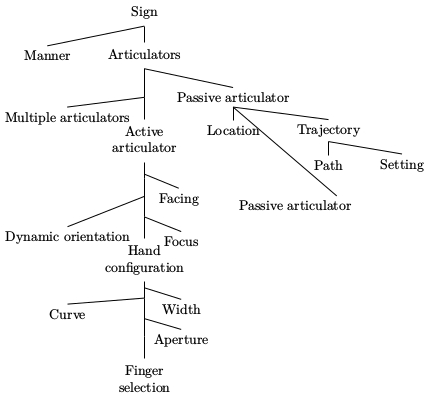

```{r setup, include=FALSE}
knitr::opts_chunk$set(echo = FALSE, message = FALSE, warnings = FALSE, fig.width = 12, fig.height = 7)
library(tidyverse)
theme_set(theme_bw())

# /home/agricolamz/work/articles/2018_Tosha_preprint_SL_annotation_verbs/repository
```

# Разметка Тоши

У нас есть Тошина разметка, что мы можем сказать интересного на ее основании? Там есть следующие названия столбцов:

```{r}
df <- read_csv("segments_old.csv", na = "")
df$label <- paste(df$Sign, df$segment)
colnames(df)
```

Я хочу найти аутлайеров как среди точек, так и среди наблюдаемых значений. Построю MCA:

```{r}
read_csv("segments_old.csv", na = "") %>% 
  select(-c(1,12, 21:26))  ->
  df_mca

df_mca <- as.data.frame(sapply(df_mca , factor))

MCA <- MASS::mca(df_mca)
df <- cbind(df, MCA$rs)
variables <- as_data_frame(MCA$cs)
variables$var_names <- rownames(MCA$cs)
```

Вот точки: <br>


##  {.tabset .tabset-fade .tabset-pills}

### Meaning
```{r}
df %>% 
  ggplot(aes(`1`, `2`, label = label))+
  geom_text()
```

Индексы  I и II -- это разные слова. Числа обозначают номер сегмента.

### H1.FingerSelection
```{r}
df %>% 
  ggplot(aes(`1`, `2`, color = `H1 FingerSelection`))+
  geom_point()+
  stat_ellipse()
```

### H1.Aperture
```{r}
df %>% 
  ggplot(aes(`1`, `2`, color = `H1 Aperture`))+
  geom_point()+
  stat_ellipse()
```

### H1.Curve
```{r}
df %>% 
  ggplot(aes(`1`, `2`, color = `H1 Curve`))+
  geom_point()+
  stat_ellipse()
```

### H1.Bent
```{r}
df %>% 
  ggplot(aes(`1`, `2`, color = `H1 Bent`))+
  geom_point()+
  stat_ellipse()
```

### H1.Facing
```{r}
df %>% 
  ggplot(aes(`1`, `2`, color = `H1 Facing`))+
  geom_point()+
  stat_ellipse()
```

### H1.Focus
```{r}
df %>% 
  ggplot(aes(`1`, `2`, color = `H1 Focus`))+
  geom_point()+
  stat_ellipse()
```

### H1.Width
```{r}
df %>% 
  ggplot(aes(`1`, `2`, color = `H1 Width`))+
  geom_point()+
  stat_ellipse()
```

### Dynamic.Orientation
```{r}
df %>% 
  ggplot(aes(`1`, `2`, color = `Dynamic Orientation`))+
  geom_point()+
  stat_ellipse()
```

### Location
```{r}
df %>% 
  ggplot(aes(`1`, `2`, color = Location))+
  geom_point()+
  stat_ellipse()
```

### Plane
```{r}
df %>% 
  ggplot(aes(`1`, `2`, color = Plane))+
  geom_point()+
  stat_ellipse()
```

### Settings
```{r}
df %>% 
  ggplot(aes(`1`, `2`, color = Settings))+
  geom_point()+
  stat_ellipse()
```

### Path
```{r}
df %>% 
  ggplot(aes(`1`, `2`, color = Path))+
  geom_point()+
  stat_ellipse()
```

### H2.FingerSelection
```{r}
df %>% 
  ggplot(aes(`1`, `2`, color = `H2 FingerSelection`))+
  geom_point()+
  stat_ellipse()
```

### H2.Aperture
```{r}
df %>% 
  ggplot(aes(`1`, `2`, color = `H2 Aperture`))+
  geom_point()+
  stat_ellipse()
```

### H2.Curve
```{r}
df %>% 
  ggplot(aes(`1`, `2`, color = `H2 Curve`))+
  geom_point()+
  stat_ellipse()
```

### H2.Bent
```{r}
df %>% 
  ggplot(aes(`1`, `2`, color = `H2 Bent`))+
  geom_point()+
  stat_ellipse()
```

### H2.Width
```{r}
df %>% 
  ggplot(aes(`1`, `2`, color = `H2 Width`))+
  geom_point()+
  stat_ellipse()
```

### H2.Facing
```{r}
df %>% 
  ggplot(aes(`1`, `2`, color = `H2 Facing`))+
  geom_point()+
  stat_ellipse()
```

### H2.Focus
```{r}
df %>% 
  ggplot(aes(`1`, `2`, color = `H2 Focus`))+
  geom_point()+
  stat_ellipse()
```

### manner_tense
```{r}
df %>% 
  ggplot(aes(`1`, `2`, color = manner_tense))+
  geom_point()+
  stat_ellipse()
```

### manner_repeated
```{r}
df %>% 
  ggplot(aes(`1`, `2`, color = manner_repeated))+
  geom_point()+
  stat_ellipse()
```

### manner_laceration
```{r}
df %>% 
  ggplot(aes(`1`, `2`, color = manner_laceration))+
  geom_point()+
  stat_ellipse()
```

### manner_symmetrical
```{r}
df %>% 
  ggplot(aes(`1`, `2`, color = manner_symmetrical))+
  geom_point()+
  stat_ellipse()
```

### manner_alternating
```{r}
df %>% 
  ggplot(aes(`1`, `2`, color = manner_alternating))+
  geom_point()+
  stat_ellipse()
```

### manner_biderectional
```{r}
df %>% 
  ggplot(aes(`1`, `2`, color = manner_biderectional))+
  geom_point()+
  stat_ellipse()
```

### manner_alternating
```{r}
df %>% 
  ggplot(aes(`1`, `2`, color = manner_alternating))+
  geom_point()+
  stat_ellipse()
```

## 

Что это за аутлайеры? <br>

```{r}
df %>% 
  arrange(desc(`1`)) %>% 
  select(labeled_url, `1`,`2`) %>% 
  DT::datatable(escape = FALSE, options = list(pageLength = 10, dom = 'ftip'))
```

Вот переменные: <br>

```{r}
variables %>% 
  ggplot(aes(`1`, `2`, label = var_names))+
  geom_text()
#  scale_x_continuous(limits = c(-0.03, 0.06))
```

Чего-то справа торчат переменные, относящиеся к правой руке.

А вот все вместе: <br>

```{r}
df %>% 
  ggplot(aes(`1`, `2`))+
  geom_text(data = variables, aes(`1`, `2`, label = var_names))+
  geom_point(color = "red")
```

## Тошина модель



Насколько важны все узлы?

```{r}
data_frame(value = colMeans(!is.na(df[,-c(1, 12, 21:26, 33:35)])),
           features = names(colMeans(!is.na(df[,-c(1, 12, 21:26, 33:35)])))) %>% 
  mutate(features = reorder(features, value)) %>% 
  ggplot(aes(features, value, label = round(value, 3)))+
  ggrepel::geom_text_repel()+
  geom_point()+
  coord_flip()+
  labs(x="", y = "ratio in the whole dataset")
```

Давай-ка выделим автоматически двуручные жесты:

```{r}
df %>% 
  mutate(two_handed = rowSums(!is.na(df[, c(14:20, 30:32)]))) %>% 
  ggplot(aes(`1`, `2`, color = two_handed, label = paste(label, two_handed)))+
  geom_text(alpha = 0.6)
```

Видно, что чем ось 1 отвечает за количество двуручных признаков в жесте.

А вторая ось отвечает за необычные признаки первой руки:

* H1-aperture closed-open
* H1-curve curved-straight
* H1-bent bent-straight
* H1-width pointed-wide
* H1-Orientation forward-neutral

## Иконичность

```{r}
df %>% 
  ggplot(aes(`1`, `2`, color = iconic))+
  geom_point()+
  stat_ellipse()
```

Хотя большинство жестов оутлайеров все же иконичны, надо отметить, что в основном центральном кластере они представлены достаточно равномерно.

# Разметка Гарика

У нас есть Тошина разметка, что мы можем сказать интересного на ее основании? Там есть следующие названия столбцов:

```{r}
df <- read_csv("segments.csv", na = "")
df$label <- paste(df$Sign, df$segment)
colnames(df)
```

Я хочу найти аутлайеров как среди точек, так и среди наблюдаемых значений. Построю MCA:

```{r}
read_csv("segments.csv", na = "") %>% 
  select(-c(1:3, 33, 36:39))  ->
  df_mca

df_mca <- as.data.frame(sapply(df_mca , factor))

MCA <- MASS::mca(df_mca)
df <- cbind(df, MCA$rs)
variables <- as_data_frame(MCA$cs)
variables$var_names <- rownames(MCA$cs)
```

Вот точки: <br>


##  {.tabset .tabset-fade .tabset-pills}

### Meaning
```{r}
df %>% 
  ggplot(aes(`1`, `2`, label = label))+
  geom_text()
```

Индексы  I и II -- это разные слова. Числа обозначают номер сегмента.

### FingerSelection
```{r}
df %>% 
  ggplot(aes(`1`, `2`, color = FingerSelection))+
  geom_point()+
  stat_ellipse()
```

### Aperture
```{r}
df %>% 
  ggplot(aes(`1`, `2`, color = Aperture))+
  geom_point()+
  stat_ellipse()
```

### H1.Curve
```{r}
df %>% 
  ggplot(aes(`1`, `2`, color = Curve))+
  geom_point()+
  stat_ellipse()
```

### H1.Bent
```{r}
df %>% 
  ggplot(aes(`1`, `2`, color = Bent))+
  geom_point()+
  stat_ellipse()
```

### H1.Facing
```{r}
df %>% 
  ggplot(aes(`1`, `2`, color = Facing))+
  geom_point()+
  stat_ellipse()
```

### H1.Focus
```{r}
df %>% 
  ggplot(aes(`1`, `2`, color = Focus))+
  geom_point()+
  stat_ellipse()
```

### H1.Width
```{r}
df %>% 
  ggplot(aes(`1`, `2`, color = Width))+
  geom_point()+
  stat_ellipse()
```

### Dynamic.Orientation
```{r}
df %>% 
  ggplot(aes(`1`, `2`, color = `Dynamic Orientation`))+
  geom_point()+
  stat_ellipse()
```

### Location
```{r}
df %>% 
  ggplot(aes(`1`, `2`, color = Location))+
  geom_point()+
  stat_ellipse()
```

### Plane
```{r}
df %>% 
  ggplot(aes(`1`, `2`, color = Plane))+
  geom_point()+
  stat_ellipse()
```

### Settings
```{r}
df %>% 
  ggplot(aes(`1`, `2`, color = Settings))+
  geom_point()+
  stat_ellipse()
```

### Path
```{r}
df %>% 
  ggplot(aes(`1`, `2`, color = Path))+
  geom_point()+
  stat_ellipse()
```

### Paddle
```{r}
df %>% 
  ggplot(aes(`1`, `2`, color = Paddle))+
  geom_point()+
  stat_ellipse()
```


### H2.FingerSelection
```{r}
df %>% 
  ggplot(aes(`1`, `2`, color = `H2 FingerSelection`))+
  geom_point()+
  stat_ellipse()
```

### H2.Aperture
```{r}
df %>% 
  ggplot(aes(`1`, `2`, color = `H2 Aperture`))+
  geom_point()+
  stat_ellipse()
```

### H2.Curve
```{r}
df %>% 
  ggplot(aes(`1`, `2`, color = `H2 Curve`))+
  geom_point()+
  stat_ellipse()
```

### H2.Bent
```{r}
df %>% 
  ggplot(aes(`1`, `2`, color = `H2 Bent`))+
  geom_point()+
  stat_ellipse()
```

### H2.Width
```{r}
df %>% 
  ggplot(aes(`1`, `2`, color = `H2 Width`))+
  geom_point()+
  stat_ellipse()
```

### H2.Facing
```{r}
df %>% 
  ggplot(aes(`1`, `2`, color = `H2 Facing`))+
  geom_point()+
  stat_ellipse()
```

### H2.Focus
```{r}
df %>% 
  ggplot(aes(`1`, `2`, color = `H2 Focus`))+
  geom_point()+
  stat_ellipse()
```

### H2 Dynamic Orientation
```{r}
df %>% 
  ggplot(aes(`1`, `2`, color = `H2 Dynamic Orientation`))+
  geom_point()+
  stat_ellipse()
```

### H2 Location
```{r}
df %>% 
  ggplot(aes(`1`, `2`, color = `H2 Location`))+
  geom_point()+
  stat_ellipse()
```

### H2 Paddle
```{r}
df %>% 
  ggplot(aes(`1`, `2`, color = `H2 Paddle`))+
  geom_point()+
  stat_ellipse()
```

### H2 Path
```{r}
df %>% 
  ggplot(aes(`1`, `2`, color = `H2 Path`))+
  geom_point()+
  stat_ellipse()
```

### H2 Plane
```{r}
df %>% 
  ggplot(aes(`1`, `2`, color = `H2 Plane`))+
  geom_point()+
  stat_ellipse()
```

### H2 Settings
```{r}
df %>% 
  ggplot(aes(`1`, `2`, color = `H2 Settings`))+
  geom_point()+
  stat_ellipse()
```

### manner_tense
```{r}
df %>% 
  ggplot(aes(`1`, `2`, color = manner_tense))+
  geom_point()+
  stat_ellipse()
```

### manner_repeated
```{r}
df %>% 
  ggplot(aes(`1`, `2`, color = manner_repeated))+
  geom_point()+
  stat_ellipse()
```

### manner_laceration
```{r}
df %>% 
  ggplot(aes(`1`, `2`, color = manner_laceration))+
  geom_point()+
  stat_ellipse()
```

### manner_symmetrical
```{r}
df %>% 
  ggplot(aes(`1`, `2`, color = manner_symmetrical))+
  geom_point()+
  stat_ellipse()
```

Не используется в MCA

### manner_alternating
```{r}
df %>% 
  ggplot(aes(`1`, `2`, color = manner_alternating))+
  geom_point()+
  stat_ellipse()
```

### manner_biderectional
```{r}
df %>% 
  ggplot(aes(`1`, `2`, color = manner_biderectional))+
  geom_point()+
  stat_ellipse()
```

### manner_alternating
```{r}
df %>% 
  ggplot(aes(`1`, `2`, color = manner_alternating))+
  geom_point()+
  stat_ellipse()
```

## 

Что это за аутлайеры? <br>

```{r}
df %>% 
  arrange(desc(`1`)) %>% 
  select(labeled_url, `1`,`2`) %>% 
  DT::datatable(escape = FALSE, options = list(pageLength = 10, dom = 'ftip'))
```

Вот переменные: <br>

```{r}
variables %>% 
  ggplot(aes(`1`, `2`, label = var_names))+
  geom_text()
#  scale_x_continuous(limits = c(-0.03, 0.06))
```

Чего-то справа торчат переменные, относящиеся к правой руке.

А вот все вместе: <br>

```{r}
df %>% 
  ggplot(aes(`1`, `2`))+
  geom_text(data = variables, aes(`1`, `2`, label = var_names))+
  geom_point(color = "red")
```

## Тошина модель


Насколько важны все узлы?

```{r}
data_frame(value = colMeans(!is.na(df[,-c(1:3, 33, 36:42)])),
           features = names(colMeans(!is.na(df[,-c(1:3, 33, 36:42)])))) %>% 
  mutate(features = reorder(features, value)) %>% 
  ggplot(aes(features, value, label = round(value, 3)))+
  ggrepel::geom_text_repel()+
  geom_point()+
  coord_flip()+
  labs(x="", y = "ratio in the whole dataset")
```

Давай-ка выделим автоматически двуручные жесты:

```{r}
df %>% 
  mutate(two_handed = rowSums(!is.na(df[, c(17:29)]))) %>% 
  ggplot(aes(`1`, `2`, color = two_handed, label = paste(label, two_handed)))+
  geom_text(alpha = 0.6)
```

Видно, что чем ось 1 отвечает за количество двуручных признаков в жесте.

## Иконичность

```{r}
df %>% 
  ggplot(aes(`1`, `2`, color = iconic))+
  geom_point()+
  stat_ellipse()
```

Хотя большинство жестов оутлайеров все же иконичны, надо отметить, что, видимо, в обоих кластерах они представлены равномерно.
